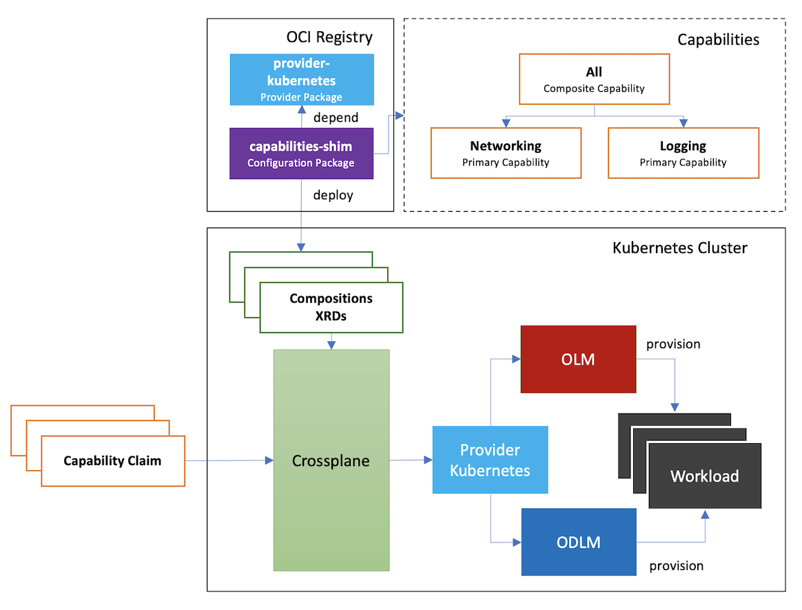

# capabilities-shim

This repository is used to prove the technical feasibility of composing variant existing software capabilities to come up with solution that meets users' specific needs quickly and easily.

It essentially leverages the composing capability provided by [Crossplane](https://crossplane.io/), along with other cloud native install methods such as [Operator Lifecycle Manager (OLM)](https://olm.operatorframework.io/), [Operand Deployment Lifecycle Manager (ODLM)](https://github.com/IBM/operand-deployment-lifecycle-manager), etc. running at backend to provision the actual workloads in a declarative way.



## Getting Started

### Launch Demo Environment

Before you can play with the sample capabilities provided by capabilities-shim, please run `demo/install.sh` to launch the demo environment:
```shell
demo/install.sh
```

After a few minutes, there will be a kind cluster up and running with the following applications deployed on it and all necessary initialization work done for you:
- Crossplane: a Kubernetes add-on that extends Kubernetes by providing you with CRDs for granular resources to be provisioned and composed into higher level abstractions.
- Operator Lifecycle Manager (OLM): a toolkit that extends Kubernetes to provide a declarative way to install, manage, and upgrade operators on a cluster.
- Operand Deployment Lifecycle Manager (ODLM): a framework that extends OLM to manage the lifecycle for a group of operands other than operators.
- capabilities-shim: An opinionated Crossplane package as a reference implementation that includes all sample capabilities for you to play with.

### Play with Capabilities

For demonstration purpose, we defined below capabilities:
- Networking, a primary capability, includes Kong as an API Gateway solution.
- Logging, a primary capability, includes Elasticsearch and Kibana for logging storage and visualization.
- All, a composite capability, including all the above capabilities as an all-in-one delivery.

To play with these capabilities, you can follow below documents to install capabilities by applying the corresponding YAML manifests.
- [Play with Capabilities (OLM)](docs/play-with-capabilities-olm.md)
- [Play with Capabilities (ODLM)](docs/play-with-capabilities-odlm.md)

### Clean Up

To clean up the demo environment:
```shell
demo/install.sh clean
```
